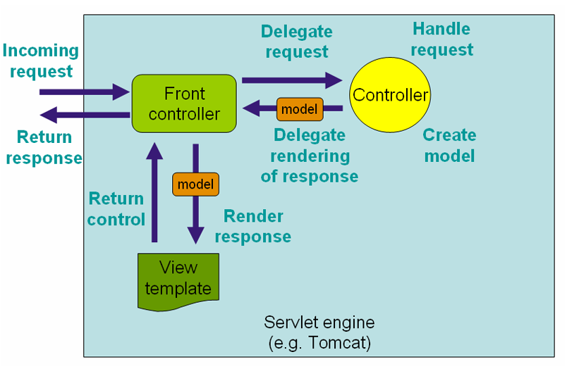
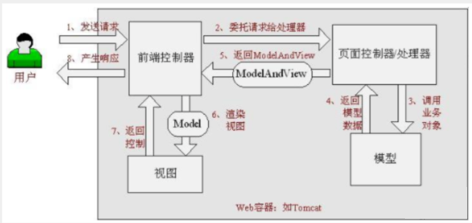
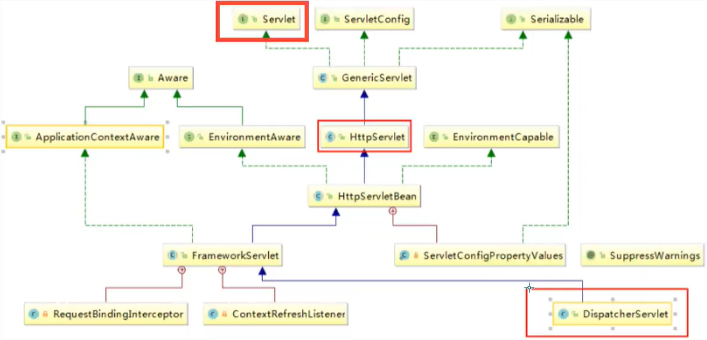

## 1-MVC

- MVC是模型(`Model`)、视图(`View`)、控制器(`Controller`)的简写，是一种软件设计规范
- 是将业务逻辑、数据、显示分离的方法来组织代码
- MVC主要作用是降低了视图与业务逻辑间的双向偶合
- MVC不是一种设计模式，MVC是一种架构模式。当然不同的MVC存在差异

dao层，连接数据库

service层，调dao层，执行一些具体业务

servlet层，接收前端界面，把数据交给service层处理，接收service层返回的结果，负责转发和重定向

### 1.1-Model

数据模型，提供要展示的数据，因此包含数据和行为，可以认为是领域模型或JavaBean组件（包含数据和行为）

不过现在一般都分离开来：Value Object（数据Dao） 和 服务层（行为Service）

也就是模型提供了模型数据查询和模型数据的状态更新等功能，包括数据和业务。

### 1.2-View

负责进行模型的展示，一般就是我们见到的用户界面，客户想看到的东西。

### 1.3-Controller

接收用户请求，委托给模型进行处理（状态改变），处理完毕后把返回的模型数据返回给视图，由视图负责展示。也就是说控制器做了个调度员的工作。

### 1.4-职责分析

Controller：控制器

1. 取得表单数据
2. 调用业务逻辑
3. 转向指定的页面

Model：模型

1. 业务逻辑
2. 保存数据的状态

View：视图

1. 显示页面

### 1.5-MVC框架需要做的事情

- 将url映射到Java类或者Java方法
- 封装用户提交的数据
- 处理请求--调用相关的业务处理--封装响应数据
- 将响应的数据进行渲染

vue、angularjs、react

## 2-Maven添加项

```xml
<dependencies>
    <dependency>
        <groupId>junit</groupId>
        <artifactId>junit</artifactId>
        <version>4.12</version>
    </dependency>
    
    <!-- https://mvnrepository.com/artifact/org.springframework/spring-web -->
    <dependency>
        <groupId>org.springframework</groupId>
        <artifactId>spring-web</artifactId>
        <version>5.3.7</version>
    </dependency>
    <!-- https://mvnrepository.com/artifact/org.springframework/spring-webmvc -->
    <dependency>
        <groupId>org.springframework</groupId>
        <artifactId>spring-webmvc</artifactId>
        <version>5.3.7</version>
    </dependency>

    <!-- https://mvnrepository.com/artifact/javax.servlet/javax.servlet-api -->
    <dependency>
        <groupId>javax.servlet</groupId>
        <artifactId>javax.servlet-api</artifactId>
        <version>4.0.1</version>
        <scope>provided</scope>
    </dependency>

    <!-- https://mvnrepository.com/artifact/javax.servlet.jsp/javax.servlet.jsp-api -->
    <dependency>
        <groupId>javax.servlet.jsp</groupId>
        <artifactId>javax.servlet.jsp-api</artifactId>
        <version>2.3.3</version>
        <scope>provided</scope>
    </dependency>
    
    <dependency>
        <groupId>javax.servlet</groupId>
        <artifactId>jstl</artifactId>
        <version>1.2</version>
    </dependency>
</dependencies>
```

## 3-什么是SpringMVC

Spring MVC是Spring Framework的一部分，是基于Java实现MVC的轻量级Web框架





### 3.1-SpringMVC的特点

1. 轻量级，简单易学
2. 高效 , 基于请求响应的MVC框架
3. 与Spring兼容性好，无缝结合
4. 约定优于配置
5. 功能强大：RESTful、数据验证、格式化、本地化、主题等
6. 简洁灵活

Spring的web框架围绕`DispatcherServlet`[`调度Servlet`]设计



