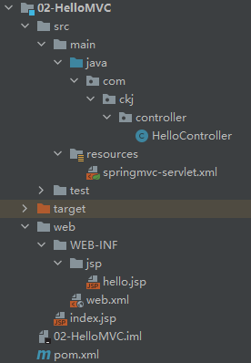
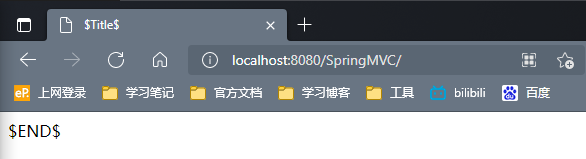
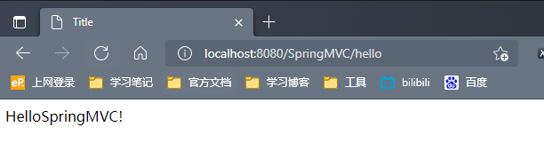
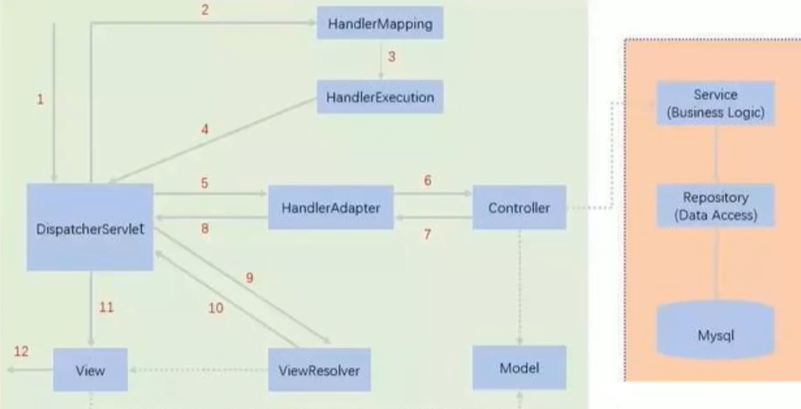
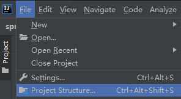
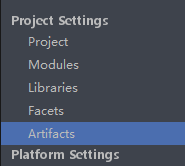
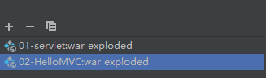
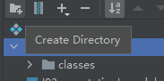
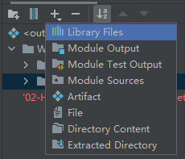
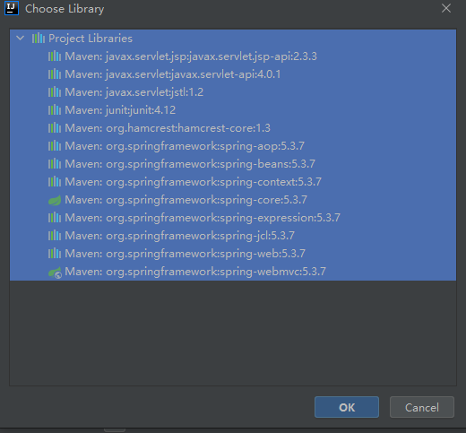

## 1-代码

### 1.1-文件目录结构



### 1.2-代码内容

#### 1.2.1-HelloController

```java
package com.ckj.controller;


import org.springframework.web.servlet.ModelAndView;
import org.springframework.web.servlet.mvc.Controller;


import javax.servlet.http.HttpServletRequest;
import javax.servlet.http.HttpServletResponse;


//注意：这里我们先导入Controller接口
public class HelloController implements Controller {


    public ModelAndView handleRequest(HttpServletRequest request, HttpServletResponse response) throws Exception {
        //ModelAndView 模型和视图
        ModelAndView mv = new ModelAndView();
		//调用业务
		//本例子中无业务
        //封装对象，放在ModelAndView中。Model
        mv.addObject("msg","HelloSpringMVC!");
        //封装要跳转的视图，放在ModelAndView中
        mv.setViewName("hello"); //: /WEB-INF/jsp/hello.jsp
        return mv;
    }

}
```

#### 1.2.2-springmvc-servlet.xml

```xml
<?xml version="1.0" encoding="UTF-8"?>
<beans xmlns="http://www.springframework.org/schema/beans"
       xmlns:xsi="http://www.w3.org/2001/XMLSchema-instance"
       xsi:schemaLocation="http://www.springframework.org/schema/beans
       http://www.springframework.org/schema/beans/spring-beans.xsd">
    
    
    <bean class="org.springframework.web.servlet.handler.BeanNameUrlHandlerMapping"/>
    <bean class="org.springframework.web.servlet.mvc.SimpleControllerHandlerAdapter"/>
    
    <!--视图解析器:DispatcherServlet给他的ModelAndView-->
    <bean class="org.springframework.web.servlet.view.InternalResourceViewResolver" id="InternalResourceViewResolver">
        <!--前缀-->
        <property name="prefix" value="/WEB-INF/jsp/"/>
        <!--后缀-->
        <property name="suffix" value=".jsp"/>
    </bean>
    
    <bean id="/hello" class="com.ckj.controller.HelloController"/>
</beans>
```

#### 1.2.3-hello.jsp

```jsp
<%@ page contentType="text/html;charset=UTF-8" language="java" %>
<html>
<head>
    <title>Title</title>
</head>
<body>
${msg}
</body>
</html>
```

#### 1.2.4-web.xml

```xml
<?xml version="1.0" encoding="UTF-8"?>
<web-app xmlns="http://xmlns.jcp.org/xml/ns/javaee"
         xmlns:xsi="http://www.w3.org/2001/XMLSchema-instance"
         xsi:schemaLocation="http://xmlns.jcp.org/xml/ns/javaee http://xmlns.jcp.org/xml/ns/javaee/web-app_4_0.xsd"
         version="4.0">
    
    <!--1.注册DispatcherServlet-->
    <servlet>
        <servlet-name>springmvc</servlet-name>
        <servlet-class>org.springframework.web.servlet.DispatcherServlet</servlet-class>
        <!--关联一个springmvc的配置文件:【servlet-name】-servlet.xml-->
        <init-param>
            <param-name>contextConfigLocation</param-name>
            <param-value>classpath:springmvc-servlet.xml</param-value>
        </init-param>
        <!--启动级别-1-->
        <load-on-startup>1</load-on-startup>
    </servlet>
    
    <!--/ 匹配所有的请求；（不包括.jsp）-->
    <!--/* 匹配所有的请求；（包括.jsp）-->
    <servlet-mapping>
        <servlet-name>springmvc</servlet-name>
        <url-pattern>/</url-pattern>
    </servlet-mapping>

</web-app>
```

#### 1.2.5-index.jsp

```jsp
<%@ page contentType="text/html;charset=UTF-8" language="java" %>
<html>
  <head>
    <title>$Title$</title>
  </head>
  <body>
  $END$
  </body>
</html>
```

### 1.3-运行结果

首先，弹出该页面`http://localhost:8080/SpringMVC/`，该页面为`index.jsp`



我们转到`http://localhost:8080/SpringMVC/hello`，完成全部跳转内容



## 2-分析执行流程



1. `DispatcherServlet`表示前置控制器，是整个`SpringMVC`的控制中心。用户发出请求，`DispatcherServlet`接收请求并拦截请求。

   我们假设请求的url为 : `http://localhost:8080/SpringMVC/hello`

   如上url拆分成三部分：

   - `http://localhost:8080`服务器域名
   - `SpringMVC`部署在服务器上的web站点
   - `hello`表示控制器
   - 通过分析，如上url表示为：请求位于服务器`localhost:8080`上的`SpringMVC`站点的`hello`控制器。

2. `HandlerMapping`为处理器映射。`DispatcherServlet`调用`HandlerMapping`，`HandlerMapping`根据请求`url`查找`Handler`——根据`url`查找`hello`这个`handle`处理器（在`spring`的配置文件中`bean`配置）

3. `HandlerExecution`表示具体的`Handler`，其主要作用是根据`url`查找控制器，如上`url`被查找控制器为：`hello`

4. `HandlerExecution`将解析后的信息传递给`DispatcherServlet`，如解析控制器映射等

5. `HandlerAdapter`表示处理器适配器，其按照特定的规则去执行`Handler`，即去适配对应的类，而在`spring`中，已经适配完成，为`HelloController`

6. `Handler`让具体的`Controller`执行，在例子中，`HelloController`实现了`Controller`接口，实现该接口需要实现一个方法 `handleRequest()`，在其中实现几大步骤

   - 建立`ModelAndView`变量，该变量可理解为，数据+需要跳转的页面
   - 调用业务层
   - 封装对象，放在`ModelAndView`中，`Model`
   - 封装要跳转的视图，放在`ModelAndView`中
   - 返回`ModelAndView`

7. `Controller`将具体的执行信息返回给`HandlerAdapter`，如`ModelAndView`

8. `HandlerAdapter`将视图逻辑名或模型传递给`DispatcherServlet`

9. `DispatcherServlet`调用视图解析器(`ViewResolver`)来解析`HandlerAdapter`传递的逻辑视图名，例子中对应`spring`配置文件中的`InternalResourceViewResolver`，其中做了以下几件事情

   - 获取ModelAndView的数据
   - 解析ModelAndView的视图名字
   - 拼接视图名字，找到对应视图
   - 将数据渲染到视图上

10. 视图解析器将解析的逻辑视图名传给`DispatcherServlet`

11. `DispatcherServlet`根据视图解析器解析的视图结果，调用具体的视图

12. 最终视图呈现给用户

1-4对应servlet、servlet-mapping

5-8对应servlet

10-12对应servlet请求转发和重定向

## 3-实现顺序

### 3.1-添加依赖至ilb





选中当前项目



在`WEB-INF`下建立文件夹`lib`



选中`lib`文件夹，点击添加`Library`



全选，点OK



### 3.2-配置DispatchServlet

这个Servlet是SpringMVC的核心，请求分发器，前端控制器

#### 3.2.1-编写`<servlet>`和`<servlet-mapping>`

```xml
<servlet>
    <servlet-name></servlet-name>
    <servlet-class></servlet-class>
</servlet>

<servlet-mapping>
    <servlet-name></servlet-name>
    <url-pattern></url-pattern>
</servlet-mapping>
```

其中

- `servlet-name`自定义，为该注册的`servlet`的`name`
- `servlet-class`=`org.springframework.web.servlet.DispatcherServlet`
- `url-pattern`，两种值
  - `/`：只匹配所有请求，不会去匹配`jsp`页面，一般写该值
  - `/*`：匹配所有请求，包括`jsp`页面

#### 3.2.2-在`<servlet>`标签内绑定springMVC的配置文件

`<init-param>`

```xml
<servlet>
    <servlet-name>springmvc</servlet-name>
    <servlet-class>org.springframework.web.servlet.DispatcherServlet</servlet-class>
    <init-param>
        <param-name></param-name>
        <param-value></param-value>
    </init-param>
</servlet>
```

`param-name`：`contextConfigLocation`

`param-value`：`classpath:`+`springmvc-servlet.xml`，其中`springmvc-servlet.xml`为自己建立的`springmvc-servlet`的配置文件

#### 3.2.3-在`<servlet>`标签内设置启动级别

`<load-on-startup>`

```xml
<load-on-startup>1</load-on-startup>
```

其中，`1`为与服务器同时启动

### 3.3-完善`springmvc-servlet.xml`

在`resources`文件夹下建立`springmvc-servlet`的配置文件——`springmvc-servlet.xml`

#### 3.3.1-处理器映射器

`HandlerMapping`

`BeanNameUrlHandlerMapping`——输入`BeanNM`，会弹出

```xml
<bean class="org.springframework.web.servlet.handler.BeanNameUrlHandlerMapping"></bean>
```

#### 3.3.2-处理器适配器

`HandlerAdapter`

`SimpleControllerHandlerAdapter`

```xml
<bean class="org.springframework.web.servlet.mvc.SimpleControllerHandlerAdapter"></bean>
```

#### 3.3.3-视图解析器

该部分必不可少，可以变

`InternalResourceViewResolver`

```xml
<bean class="org.springframework.web.servlet.view.InternalResourceViewResolver" id="internalResourceViewResolver"></bean>
```

配置前缀后缀

在`InternalResourceViewResolver`这个`bean`标签下配置文件的前缀和后缀

```xml
<bean class="org.springframework.web.servlet.view.InternalResourceViewResolver" id="internalResourceViewResolver">
    <property name="prefix" value="/WEB-INF/jsp/"></property>
    <property name="suffix" value=".jsp"></property>
</bean>
```

若前缀为文件路径，最好在前缀的最后加上`/`

### 3.4-配置Controller

创建实现类，实现`Controller`接口，并实现方法`handleRequest`

```java
package com.ckj.controller;

import org.springframework.web.servlet.ModelAndView;
import org.springframework.web.servlet.mvc.Controller;

import javax.servlet.http.HttpServletRequest;
import javax.servlet.http.HttpServletResponse;

public class HelloController implements Controller {
    @Override
    public ModelAndView handleRequest(HttpServletRequest httpServletRequest, HttpServletResponse httpServletResponse) throws Exception {
        return null;
    }
}
```

#### 3.4.1-完善handleRequest方法

- 建立`ModelAndView`变量，该变量可理解为，数据+需要跳转的页面

  ```java
  ModelAndView mv = new ModelAndView();
  ```

- 调用业务层

  本例子中暂无

- 封装对象，放在`ModelAndView`中，`Model`

  ```java
  mv.addObject("msg","HelloSpringMVC");
  ```

  牢记`mv`下面两个方法

  - `addObject(key,value)`
  - 

- 封装要跳转的视图，放在`ModelAndView`中

  `mv.setViewName()`通过封装需要跳转的视图名字，来实现跳转视图的设置

- 返回`ModelAndView`

  ```java
  return mv;
  ```

### 3.5-配置bean

由于我们用的是`BeanNameUrlHandlerMapping`，所以需要配置`BeanNameUrlHandlerMapping`所用到的`bean`，本例子中，为在`spring`配置文件中注册`HelloController`，其中的`id`相当于`servlet`的`url-parttern`，即我们访问站点下网页的地址，这里必须加上`/`

```xml
<bean class="com.ckj.controller.HelloController" id="/hello"></bean>
```

## 4-注解配置

### 4.1-添加依赖至lib

同[3.1-添加依赖至lib](#3.1-添加依赖至ilb)

### 4.2-配置DispatchServlet

同[3.2-配置DispatchServlet](#3.2-配置DispatchServlet)

### 4.3-配置springmvc-servlet.xml

在`java`目录下，建立包`com.ckj.controller`

#### 4.3.1-配置自动扫描包

```xml
<context:component-scan base-package="com.ckj.controller"></context:component-scan>
```

#### 4.3.2-让SpringMVC不处理静态资源

静态资源如：`.css`、`.js`、`.html`、`.mp4`

```xml
<mvc:default-servlet-handler></mvc:default-servlet-handler>
```

该表达式固定

#### 4.3.3-开启HandlerMapping和HandlerAdapter

```xml
<mvc:annotation-driven></mvc:annotation-driven>
```

#### 4.3.3-视图解析器

同[3.3.3-视图解析器](#3.3.3-视图解析器)

### 4.4-配置Controller

建立`HelloController`类

添加`@Controller`注解

在这个类中，建立方法，这个方法有几个特征：

- 方法的返回值为`String`类型

  返回值会被视图解析器处理，即`springmvc-servlet.xml`中配置的视图解析器，用于在寻找到对应文件，方式为直接拼接，但此处并不是`url`

- 方法的参数可自行设置

  `Model`(`org.springframework.ui.Model`)用于传递参数，实现数据的封装
  
  其他参数则代表着在访问该地址时需传参数，如
  
  `public String hello(int a,int b,Model model)`，访问该`controller`时，需通过`RestFul`风格传递参数，参考 [4.RestFul.md](4.RestFul.md) 

```java
@Controller
public class HelloController {
    public String hello(Model model){
        //封装数据
        model.addAttribute("msg","Hello,ckj");

        return "hello";
    }
}
```

添加`@RequestMapping("")`

- 在方法前

  其中的值为视图的名字

  ```java
  @Controller
  public class HelloController {
  
      @RequestMapping("/hello")
      public String hello(Model model){
          //封装数据
          model.addAttribute("msg","Hello,ckj");
          return "hello";
      }
  }
  ```

  在本例子中`url`为：`localhost:8080//SpringMVC/hello`

- 在类名前添加

  该类下的所有方法的`url`之前都需要加上该部分

  ```java
  @Controller
  @RequestMapping("/hello")
  public class HelloController {
  
      @RequestMapping("/h1")
      public String hello(Model model){
          //封装数据
          model.addAttribute("msg","Hello,ckj");
          return "hello";
      }
  }
  ```

  本例中的`url`为：`localhost:8080//SpringMVC/hello/h1`

在SpringMVC中必须配置的三大件：

- 处理器映射器，`HandlerMapping`
- 处理器适配器，`HandlerAdapter`
- 视图解析器，`ViewResolver`

通过`注解驱动`的方式，我们只需要手动配置`视图解析器`，而`处理器映射器`和`处理器适配器`只需要开启注解驱动即可。
