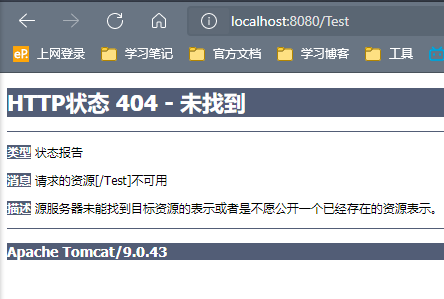
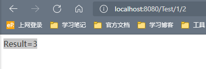
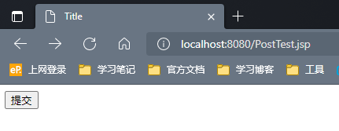
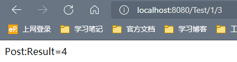
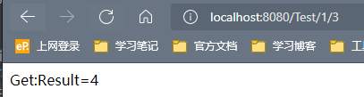

## 1-相关知识

### 1.1-概念

Restful是一个资源定位及资源操作的风格。不是标准也不是协议。只是一种风格。基于这个风格设计的软件可以更简介，更有层次，更易于实现缓存等机制

### 1.2-功能

- 资源：互联网所有的事物都可以被抽象为资源
- 资源操作：使用POST（添加）、DELETE（删除）、PUT（修改）、GET（查询），使用不同方法对资源进行操作

### 1.3-范例

`http://localhost:8080//test/1/2/3`

## 2-实现

### 2.1-新建测试类

```java
@Controller
public class ControllerTest {
	@RequestMapping("/Test")
    public String test1(int a,int b,Model model){

        return "test";
    }
}
```

### 2.2-设置参数

在`SpringMVC`中可以使用`@PathVariable`注解，让方法的参数值对应绑定到一个`URL`模板变量上，此时，也需要在对应的`URL`上写清楚变量使用顺序

```java
@Controller
public class ControllerTest {
    @RequestMapping("/Test/{a}/{b}")
    public String test1(@PathVariable int a, @PathVariable int b, Model model) {
        int res = a + b;
        model.addAttribute("msg", "Result=" + res);
        return "test";
    }
}
```

### 2.3-运行结果

访问地址：`http://localhost:8080/Test`，结果为404不能找到



再访问`http://localhost:8080/Test/1/2`，按照程序设计，我们得到的结果应该为`Result=3`，事实也是如此，此时，原来的`url`访问方式会不能成功访问



### 2.4-详解

代码中的`@RequestMapping("/Test/{a}/{b}")`，详尽书写方式为：`@RequestMapping(value = "/Test/{a}/{b}", method = RequestMethod.GET)`

我们观察`@RequestMapping`的源码

```java
@Target({ElementType.TYPE, ElementType.METHOD})
@Retention(RetentionPolicy.RUNTIME)
@Documented
@Mapping
public @interface RequestMapping {
    String name() default "";
    @AliasFor("path")
    String[] value() default {};
    @AliasFor("value")
    String[] path() default {};
    RequestMethod[] method() default {};
    String[] params() default {};
    String[] headers() default {};
    String[] consumes() default {};
    String[] produces() default {};
}
```

可见，其中有很多方法，其中`RequestMethod`属性规定了`http`请求的类型（get、post……）

查看`RequestMethod`的源码

```java
package org.springframework.web.bind.annotation;

public enum RequestMethod {
    GET,
    HEAD,
    POST,
    PUT,
    PATCH,
    DELETE,
    OPTIONS,
    TRACE;

    private RequestMethod() {
    }
}
```

其中，规定了所有的方法

### 2.5-简略书写

`@RequestMapping(value = "/Test/{a}/{b}", method = RequestMethod.GET)`

这行代码，我们可以将其进一步缩略：

`@GetMapping("/Test/{a}/{b}")`

所有的地址栏请求默认都会是`HTTP GET`类型的

方法级别的注解变体有如下几个：组合注解

```
@GetMapping
@PostMapping
@PutMapping
@DeleteMapping
@PatchMapping
```

### 2.6-相同url，不同方法

在`ControllerTest`中将方法修改为以下内容

```java
@GetMapping("/Test/{a}/{b}")
public String test1(@PathVariable int a, @PathVariable int b, Model model) {
    int res = a + b;
    model.addAttribute("msg", "Get:Result=" + res);
    return "test";
}

@PostMapping("/Test/{a}/{b}")
public String test2(@PathVariable int a, @PathVariable int b, Model model) {
    int res = a + b;
    model.addAttribute("msg", "Post:Result=" + res);
    return "test";
}
```

其中，运用了`Post`和`Get`两种请求方法

在`web`文件夹下，建立`PostTest.jsp`文件，`body`部分内容为：

```jsp
<form action="/Test/1/3" method="post">
    <input type="submit">
</form>
```

运行`Tomcat`，输入`http://localhost:8080/PostTest.jsp`，弹出以下界面



点击提交，根据我们的代码，可得，提交之后，访问的`url`路径为：`http://localhost:8080/Test/1/3`

此时的显示结果为：



执行的方法为`Post`方法

我们再直接通过`url`：`http://localhost:8080/Test/1/3`进行访问，结果为：



因为通过`url`进行直接访问，是通过默认方法`Get`，进行访问资源，所以此时执行的`servlet`为`test1()`

### 2.7-常见错误

1. 如果两个`servlet`的访问方法是相同的，如同是`Get`、`Post`

   错误信息：`Ambiguous mapping`

   解决方法：只需要将冲突的访问方法排查好
2. 

