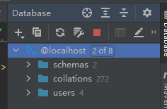

## 1-环境配置

### 1.1-导入Maven依赖

```xml
<!--依赖：junit、数据库驱动、连接池、servlet、jsp、mybatis、mybatis-spring、spring-->
<dependencies>
    <dependency>
        <groupId>junit</groupId>
        <artifactId>junit</artifactId>
        <version>4.13.2</version>
        <scope>test</scope>
    </dependency>
    <dependency>
        <groupId>mysql</groupId>
        <artifactId>mysql-connector-java</artifactId>
        <version>8.0.11</version>
    </dependency>
    <!-- https://mvnrepository.com/artifact/org.springframework/spring-web -->
    <dependency>
        <groupId>org.springframework</groupId>
        <artifactId>spring-web</artifactId>
        <version>5.3.7</version>
    </dependency>
    <!-- https://mvnrepository.com/artifact/org.springframework/spring-webmvc -->
    <dependency>
        <groupId>org.springframework</groupId>
        <artifactId>spring-webmvc</artifactId>
        <version>5.3.7</version>
    </dependency>
    
    <!-- https://mvnrepository.com/artifact/javax.servlet/javax.servlet-api -->
    <dependency>
        <groupId>javax.servlet</groupId>
        <artifactId>javax.servlet-api</artifactId>
        <version>4.0.1</version>
        <scope>provided</scope>
    </dependency>
    
    <!-- https://mvnrepository.com/artifact/javax.servlet.jsp/javax.servlet.jsp-api -->
    <dependency>
        <groupId>javax.servlet.jsp</groupId>
        <artifactId>javax.servlet.jsp-api</artifactId>
        <version>2.3.3</version>
        <scope>provided</scope>
    </dependency>
    
    <dependency>
        <groupId>javax.servlet</groupId>
        <artifactId>jstl</artifactId>
        <version>1.2</version>
    </dependency>
    
    <!-- https://mvnrepository.com/artifact/com.mchange/c3p0 -->
    <dependency>
        <groupId>com.mchange</groupId>
        <artifactId>c3p0</artifactId>
        <version>0.9.5.5</version>
    </dependency>
    
    <dependency>
        <groupId>org.mybatis</groupId>
        <artifactId>mybatis</artifactId>
        <version>3.5.6</version>
    </dependency>

    <!-- https://mvnrepository.com/artifact/org.mybatis/mybatis-spring -->
    <dependency>
        <groupId>org.mybatis</groupId>
        <artifactId>mybatis-spring</artifactId>
        <version>2.0.6</version>
    </dependency>

    <!-- https://mvnrepository.com/artifact/org.springframework/spring-jdbc -->
    <dependency>
        <groupId>org.springframework</groupId>
        <artifactId>spring-jdbc</artifactId>
        <version>5.3.7</version>
    </dependency>

    <dependency>
        <groupId>org.projectlombok</groupId>
        <artifactId>lombok</artifactId>
        <version>1.18.20</version>
    </dependency>
</dependencies>
```

### 1.2-配置静态资源导入

```xml
<build>
    <resources>
        <resource>
            <directory>src/main/resources</directory>
            <includes>
                <include>**/*.properties</include>
                <include>**/*.xml</include>
            </includes>
            <filtering>true</filtering>
        </resource>
        <resource>
            <directory>src/main/java</directory>
            <includes>
                <include>**/*.properties</include>
                <include>**/*.xml</include>
            </includes>
            <filtering>true</filtering>
        </resource>
    </resources>
</build>
```

### 1.3-搭建数据库

```mysql
CREATE DATABASE `ssmbuild`;
 
USE `ssmbuild`;
 
DROP TABLE IF EXISTS `books`;
 
CREATE TABLE `books` (
  `bookID` INT(10) NOT NULL AUTO_INCREMENT COMMENT '书id',
  `bookName` VARCHAR(100) NOT NULL COMMENT '书名',
  `bookCounts` INT(11) NOT NULL COMMENT '数量',
  `detail` VARCHAR(200) NOT NULL COMMENT '描述',
  KEY `bookID` (`bookID`)
) ENGINE=INNODB DEFAULT CHARSET=utf8
 
INSERT  INTO `books`(`bookID`,`bookName`,`bookCounts`,`detail`)VALUES 
(1,'Java',1,'从入门到放弃'),
(2,'MySQL',10,'从删库到跑路'),
(3,'Linux',5,'从进门到进牢');
```

### 1.4-连接数据库



## 2-建立基本结构

- com.ckj.pojo
  - Books
- com.ckj.dao
  - BookMapper
  - BookMapper.xml
  - BookMapperImpl
- com.ckj.service
  - BookService
  - BookServiceImpl
- com.ckj.controller
  - BookController

## 3-mybatis配置

### 3.1-数据库配置文件

`database.properties`

```properties
jdbc.driver=com.mysql.cj.jdbc.Driver
jdbc.url=jdbc:mysql://localhost:3306/mybatis?useSSL=false&serverTimezone=UTC&allowPublicKeyRetrieval=true&useUnicode=true&characterEncoding=UTF-8
jdbc.username=root
jdbc.password=ckj
```

### 3.2-mybatis-config.xml

- 别名
- 注册`mapper`

```xml
<?xml version="1.0" encoding="UTF-8" ?>
<!DOCTYPE configuration
        PUBLIC "-//mybatis.org//DTD Config 3.0//EN"
        "http://mybatis.org/dtd/mybatis-3-config.dtd">
<configuration>
    <typeAliases>
        <package name="com.ckj.pojo" />
    </typeAliases>
    
    <mappers>
        <mapper resource="com/ckj/dao/BookMapper.xml"></mapper>
    </mappers>
</configuration>
```

### 3.3-编写实体类

`com.ckj.pojo.Books`

```java
package com.ckj.pojo;

import lombok.AllArgsConstructor;
import lombok.Data;
import lombok.NoArgsConstructor;

@Data
@AllArgsConstructor
@NoArgsConstructor
public class Books {
    private int bookID;
    private String bookName;
    private int bookCounts;
    private String detail;

}
```

### 3.4-编写dao层的mapper接口

```java
package com.ckj.dao;

import com.ckj.pojo.Books;
import org.apache.ibatis.annotations.Param;

import java.util.List;

public interface BookMapper {
    List<Books> queryAllBook();
}
```

### 3.5-编写对应的Mapper.xml文件

```xml
<?xml version="1.0" encoding="UTF-8" ?>
<!DOCTYPE mapper
        PUBLIC "-//mybatis.org//DTD Config 3.0//EN"
        "http://mybatis.org/dtd/mybatis-3-mapper.dtd">
<mapper namespace="com.ckj.dao.BookMapper">
    <select id="queryAllBook" resultType="Books">
        SELECT *
        from ssmbuild.books
    </select>
</mapper>
```

### 3.6-编写Service层的接口和实现类

`com.ckj.service.BookService`

```java
package com.ckj.service;

import com.ckj.pojo.Books;
import org.apache.ibatis.annotations.Param;

import java.util.List;

public interface BookService {
    List<Books> queryAllBook();
}
```

`com.ckj.service.BookServiceImpl`

```java
package com.ckj.service;

import com.ckj.dao.BookMapper;
import com.ckj.pojo.Books;

import java.util.List;

public class BookServiceImpl implements BookService {
    private BookMapper bookMapper;

    public void setBookMapper(BookMapper bookMapper) {
        this.bookMapper = bookMapper;
    }
    
    @Override
    public List<Books> queryAllBook() {
        return bookMapper.queryAllBook();
    }
}
```

至此，底层需求编写完成

## 4-spring配置

### 4.1-核心配置文件

`applicationContext.xml`

```xml
<?xml version="1.0" encoding="UTF-8"?>
<beans xmlns="http://www.springframework.org/schema/beans"
       xmlns:xsi="http://www.w3.org/2001/XMLSchema-instance"
       xsi:schemaLocation="http://www.springframework.org/schema/beans http://www.springframework.org/schema/beans/spring-beans.xsd">
    
</beans>
```

其下，建立多个`spring`分管文件(`xml`)，分别对应dao、service、mvc

### 4.2-spring-dao

`spring`整合`mybatis`

- 导入`database.properties`
- 配置`dataSource`
- 配置`sqlSessionFactory`——`dataSource`+`mybatis-config.xml`
- 配置`MapperScannerConfigurer`——`sqlSessionFactoryBeanName`+`basePackage`

```xml
<?xml version="1.0" encoding="UTF-8"?>
<beans xmlns="http://www.springframework.org/schema/beans"
       xmlns:xsi="http://www.w3.org/2001/XMLSchema-instance"
       xmlns:context="http://www.springframework.org/schema/context"
       xsi:schemaLocation="http://www.springframework.org/schema/beans
       http://www.springframework.org/schema/beans/spring-beans.xsd
       http://www.springframework.org/schema/context
       https://www.springframework.org/schema/context/spring-context.xsd">
    
    <context:property-placeholder location="classpath:database.properties"></context:property-placeholder>
    
    <bean id="dataSource" class="com.mchange.v2.c3p0.ComboPooledDataSource">
        <property name="driverClass" value="${jdbc.driver}"></property>
        <property name="jdbcUrl" value="${jdbc.url}"></property>
        <property name="user" value="${jdbc.username}"></property>
        <property name="password" value="${jdbc.password}"></property>
    </bean>
    
    <bean id="sqlSessionFactory" class="org.mybatis.spring.SqlSessionFactoryBean">
        <property name="dataSource" ref="dataSource"></property>
        <property name="configLocation" value="classpath:mybatis-config.xml"></property>
    </bean>
    
    <bean class="org.mybatis.spring.mapper.MapperScannerConfigurer">
        <property name="sqlSessionFactoryBeanName" value="sqlSessionFactory"></property>
        <property name="basePackage" value="com.ckj.dao"></property>
    </bean>
</beans>
```

### 4.3-spring-service

- 自动扫描接口包
- `BookServiceImpl`注入到`IOC`容器——配置实体类
- 配置事务管理——注入数据库连接池`dataSource`

```xml
<?xml version="1.0" encoding="UTF-8"?>
<beans xmlns="http://www.springframework.org/schema/beans"
       xmlns:xsi="http://www.w3.org/2001/XMLSchema-instance"
       xmlns:context="http://www.springframework.org/schema/context"
       xsi:schemaLocation="http://www.springframework.org/schema/beans http://www.springframework.org/schema/beans/spring-beans.xsd http://www.springframework.org/schema/context https://www.springframework.org/schema/context/spring-context.xsd">
    
    <context:component-scan base-package="com.ckj.service"></context:component-scan>
    
    <bean id="BookServiceImpl" class="com.ckj.service.BookServiceImpl">
        <property name="bookMapper" ref="bookMapper"></property>
    </bean>
    
    <bean id="transactionManager" class="org.springframework.jdbc.datasource.DataSourceTransactionManager">
        <property name="dataSource" ref="dataSource"></property>
    </bean>
</beans>
```

至此，spring层搞定

spring-mvc.xml的配置位于SpringMVC板块

## 5-SpringMVC

### 5.1-web.xml

- 配置`DispatcherServlet`
  - `servlet`——`name`+`class`+`init-param`+`load-on-startup`
  - `servlet-mapping`——`name`+`url-pattern`
- `filter`

```xml
<?xml version="1.0" encoding="UTF-8"?>
<web-app xmlns="http://xmlns.jcp.org/xml/ns/javaee"
         xmlns:xsi="http://www.w3.org/2001/XMLSchema-instance"
         xsi:schemaLocation="http://xmlns.jcp.org/xml/ns/javaee http://xmlns.jcp.org/xml/ns/javaee/web-app_4_0.xsd"
         version="4.0">
    <servlet>
        <servlet-name>springmvc</servlet-name>
        <servlet-class>org.springframework.web.servlet.DispatcherServlet</servlet-class>
        <init-param>
            <param-name>contextConfigLocation</param-name>
            <param-value>classpath:applicationContext.xml</param-value>
        </init-param>
        <load-on-startup>1</load-on-startup>
    </servlet>
    
    <servlet-mapping>
        <servlet-name>springmvc</servlet-name>
        <url-pattern>/</url-pattern>
    </servlet-mapping>
    
    <filter>
        <filter-name>encodingFilter</filter-name>
        <filter-class>org.springframework.web.filter.CharacterEncodingFilter</filter-class>
        <init-param>
            <param-name>encoding</param-name>
            <param-value>utf-8</param-value>
        </init-param>
    </filter>
    <filter-mapping>
        <filter-name>encodingFilter</filter-name>
        <url-pattern>/*</url-pattern>
    </filter-mapping>
    
    <session-config>
        <session-timeout>15</session-timeout>
    </session-config>
</web-app>
```

### 5.2-spring-mvc.xml

- 开启`SpringMVC`注解驱动——`mvc:annotation-driven`
- 静态资源默认`servlet`配置——`mvc:default-servlet-handler`
- 配置`jsp`，显示`ViewResolver`视图解析器`InternalResourceViewResolver`
- 扫描`web`相关的`bean`——`controller`包

```xml
<?xml version="1.0" encoding="UTF-8"?>
<beans xmlns="http://www.springframework.org/schema/beans"
       xmlns:xsi="http://www.w3.org/2001/XMLSchema-instance"
       xmlns:mvc="http://www.springframework.org/schema/mvc"
       xmlns:context="http://www.springframework.org/schema/context"
       xsi:schemaLocation="
       http://www.springframework.org/schema/beans
       http://www.springframework.org/schema/beans/spring-beans.xsd
       http://www.springframework.org/schema/mvc
       http://www.springframework.org/schema/mvc/spring-mvc.xsd
       http://www.springframework.org/schema/context
       https://www.springframework.org/schema/context/spring-context.xsd">

    <mvc:annotation-driven></mvc:annotation-driven>
    <mvc:default-servlet-handler></mvc:default-servlet-handler>
    <bean class="org.springframework.web.servlet.view.InternalResourceViewResolver">
        <property name="prefix" value="/WEB-INF/jsp/"></property>
        <property name="suffix" value=".jsp"></property>
    </bean>
    <context:component-scan base-package="com.ckj.controller"></context:component-scan>
</beans>
```

至此，Spring所有配置结束

整合配置文件，将`dao`、`service`、`mvc`的`xml`配置文件整合到`applicationContext`中

`applicationContext.xml`

```xml
<?xml version="1.0" encoding="UTF-8"?>
<beans xmlns="http://www.springframework.org/schema/beans"
       xmlns:xsi="http://www.w3.org/2001/XMLSchema-instance"
       xsi:schemaLocation="http://www.springframework.org/schema/beans http://www.springframework.org/schema/beans/spring-beans.xsd">

    <import resource="spring-dao.xml"></import>
    <import resource="spring-service.xml"></import>
    <import resource="spring-mvc.xml"></import>
</beans>
```

## 6-编写Controller和视图层

### 6.1-编写`BookController`类，查询全部书籍

```java
@Controller
@RequestMapping("/book")
public class BookController {
    @Autowired
    @Qualifier("BookServiceImpl")
    private BookService bookService;

    //查询全部的书籍，并且返回到一个书籍展示页面
    @RequestMapping("/allBook")
    public String list(Model model) {
        List<Books> booksList = bookService.queryAllBook();
        model.addAttribute("booksList", booksList);
        return "allBook";
    }
}
```

### 6.2-编写视图层

各种页面jsp、html
